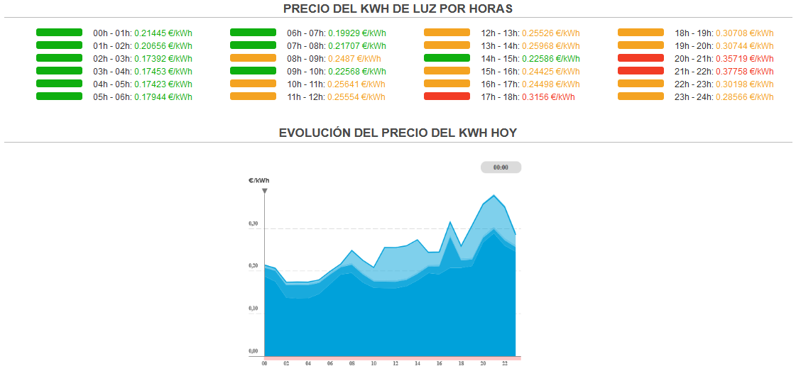

Bienviendo a la página principal del proyecto para la asignatura de *Cloud Computing* del Máster de Ingeniería Informático de la Universidad de Granada.

:warning: Debido a la fase temprana en la que se encuentra el proyecto aún no tiene nombre.

---

## Enlaces

En la documentación del proyecto podemos encontrar actualmente la siguiente información:

- [Configuración de git y Github](https://github.com/SrArtur/CC_22-23/blob/main/docs/configuration.md)

- [Descripción del proyecto](https://github.com/SrArtur/CC_22-23/blob/main/docs/hio0.md). También disponible más abajo.

----

## HITO 0 - Descripción

El proyecto propuesto, con nombre aún por determinar, es una aplicación con el objetivo que consiga minimizar la factura de la luz y cuidar más el medioambiente. Para ello se parte del **Precio Voluntario para el Pequeño Consumidor**, más comunmente conocido por sus siglas **PVPC**, la tarifa eléctrica regulada.

Esta tarifa sufrió una reestructuración el 1 de junio de 2021, y en la actualidad cuenta con una discriminación horaria en tres periodos, en los que la aplicación de peajes y cargos regulatorios variará:

- **Periodo punta** :red_circle: , en el que dichos peajes y cargos serán más elevados.

- **Periodo llano** :yellow_circle:, con un impacto intermedio de estos costes regulados.

- **Periodo valle** :green_circle:, periodo en el que estos peajes y cargos serán más bajos.

En el contexto global que nos encontramos, viviendo las secuelas de una pandemia además de la crisis sanitaria mundial y la guerra en activo de Ucrania y Rusia unido a las evidentes manifestaciones del cambio climático, ha hecho que la inflación se dispare y con ello, el costo de la vida.

Por ello nace esta aplicación, para **minimizar el precio en la factura de la luz**. Cada noche, sobre las 20 horas, se publica el precio que tendrá el Kilovatio-hora en cada uno de los tramos del día siguiente, como el ejemplo en la siguiente figura.

El objetivo principalmente pasa por saber cuándo son los tramos, durante cuanto tiempo, tendencias, etc. Para poder planificar el uso de los electrodomésticos más pesados como pueden ser lavadoras, lavavajillas o sistemas de climatización. Sirviendo de base a las tareas de automatización, con el beneficio de ser más eficientes.

